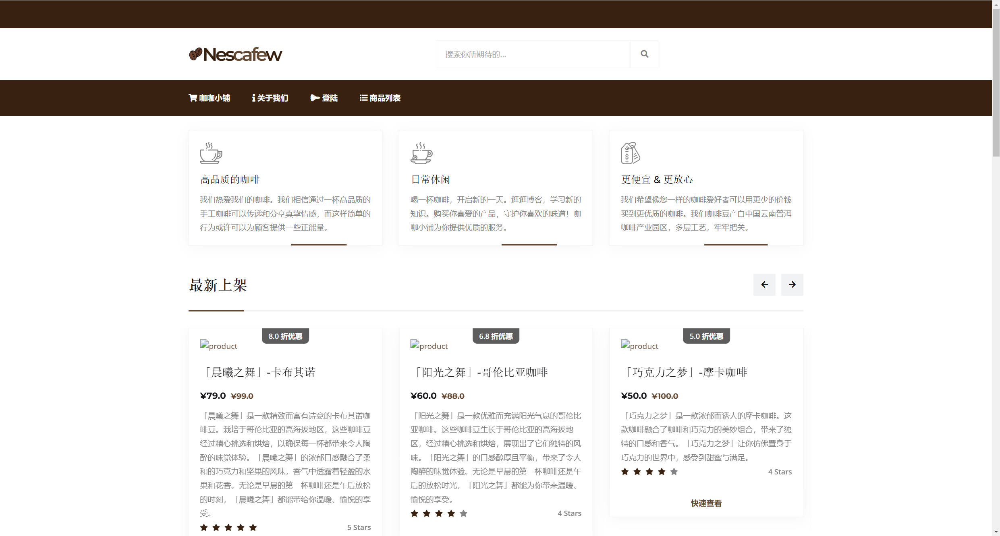
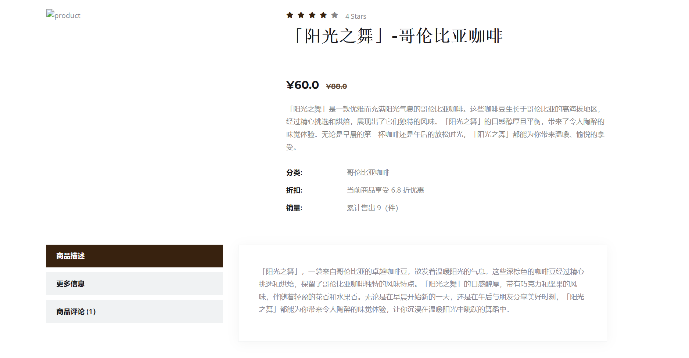
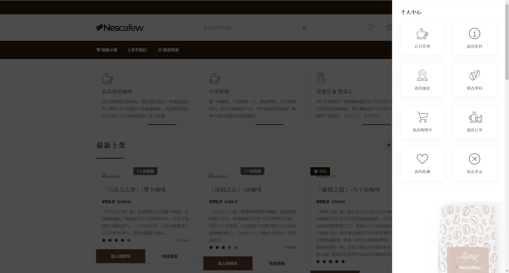
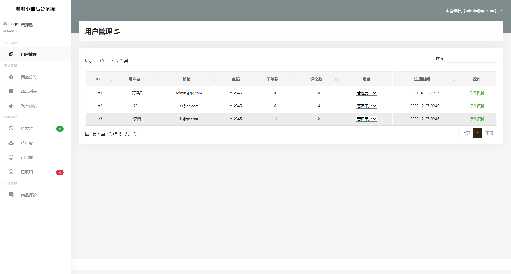
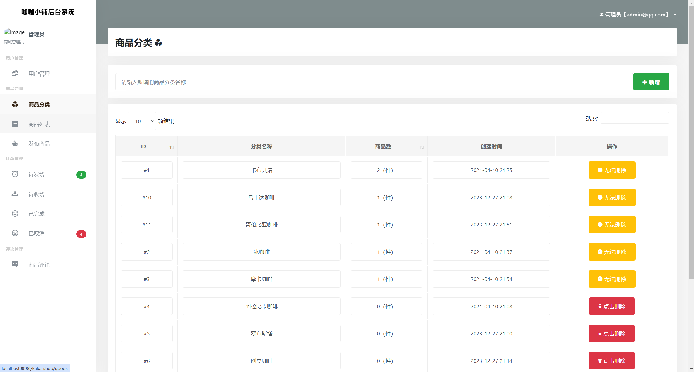
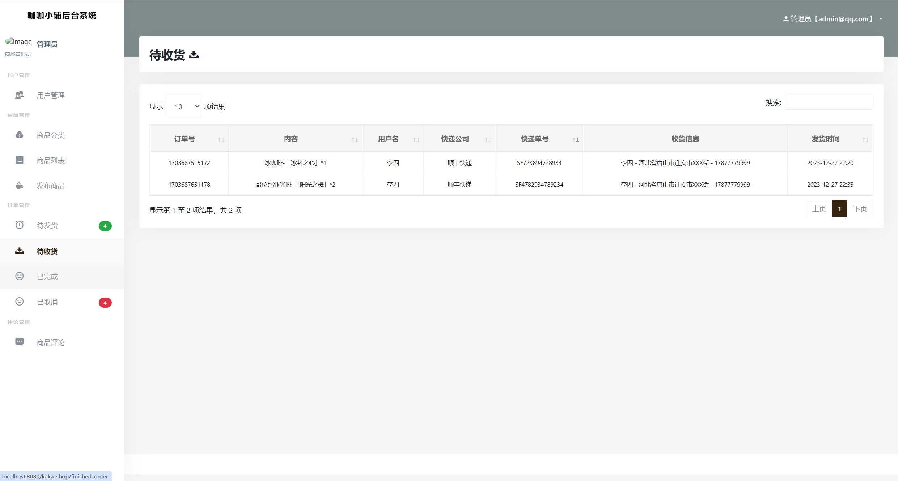

## 前言

## 项目介绍

咖咖商城（kaka-shop）是一个基于 SpringBoot 开发的标准 Java Web
项目。系统整体页面设计简约精美，交互新颖，是一款制作精良的服务于咖啡爱好者的商城系统。该系统不仅易于初学者理解和学习，而且在学校项目答辩和毕业设计等场景中表现出色。

## 系统截图

## 价格（良心价）

1. **199单项目**
2. **249包安装**

### 角色介绍

系统共设计了三个角色：游客、用户、管理员。

1. 游客：尚未进行注册和登录。具备登录注册、浏览主页、浏览商品及评论、搜索商品等权限。
2. 用户：除了游客的功能权限外，还具备登录、个人资料的修改、登录密码修改、收获地址、商品收藏、购物车、商品订单、评价等权限。
3. 管理员：除了用户的功能权限外，还具备商城后台管理：用户管理、商品分类、商品管理、订单管理、评价管理等。

### 功能介绍

#### 游客功能介绍

| 功能模块   | 功能描述                         |
|--------|------------------------------|
| 登录注册方面 | 注册成为系统用户                     |
| 系统主页   | 浏览系统主页、商品详情、商品搜索、分类查看、查看优惠折扣 |

#### 用户功能介绍

| 功能模块   | 功能描述                                         |
|--------|----------------------------------------------|
| 登录注册方面 | 填写用户信息进行账号注册、使用邮箱密码进行登录、忘记密码（使用邮件提醒）         |
| 个人资料方面 | 修改个人资料、修改登录密码                                |
| 地址管理方面 | 维护个人的收获地址，可设置多个地址，并设置其中一个为默认收获地址             |
| 商品收藏方面 | 浏览商品、加入收藏夹，可将收藏夹的商品直接加入购物车                   |
| 购物车方面  | 将商品加入购物车、自动计算购物车的价格（计算优惠）                    |
| 购买商品方面 | 创建商品订单，选择收货地址，去支付（当时没有对接支付系统，所以用的是假支付）       |
| 订单管理方面 | 查看待发货订单、已发货订单、取消订单、确认收货                      |
| 商品评价方面 | 确认收货后可对商品进行评价，评星数、评语等，评星数将影响系统的商品推荐，评星评语公开可见 |

#### 管理员功能介绍

| 功能模块   | 功能描述                                                    |
|--------|---------------------------------------------------------|
| 登录注册方面 | 使用邮箱密码进行登录、忘记密码（使用邮件提醒）                                 |
| 个人资料方面 | 修改个人资料、修改登录密码                                           |
| 用户管理方面 | 管理系统的注册用户、修改用户资料、修改用户资料                                 |
| 商品分类管理 | 维护商品分类（若当前分类下已存在商品，那么禁止删除）                              |
| 商品管理方面 | 发布商品（名称、颜色、原材料、产地、描述、封面、原价、现价、库存、状态等信息）、修改商品信息、上架下架、删除等 |
| 商品订单管理 | 查看待发货、已发货、已完成、已取消的订单，商品发货（填写快递号、厂商），删除订单等               |
| 商品评价管理 | 查看全部评价、回复评价、删除评价等                                       |

## 技术介绍

### 前端

| 名称                | 描述                                                      |
|:------------------|---------------------------------------------------------|
| HTML、CSS          | 用于设计网页的内容和样式                                            |
| JavaScript、JQuery | 作为开发 Web 页面的脚本语言，为网页添加各式各样的动态功能，为用户提供更流畅美观的浏览效果         |
| Bootstrap         | 基于 HTML、CSS、JavaScript 开发的简洁、直观、强悍的前端开发框架，使得 Web 开发更加快捷 |
| 前端模板              | 智慧医药系统页面模板，模板文件已放在分享项目目录下                               |

### 后端

| 名称         | 描述                                                                                                                                               |
|------------|--------------------------------------------------------------------------------------------------------------------------------------------------|
| SpringBoot | SpringBoot 是由 Pivotal 团队提供的全新框架，其设计目的是用来简化新 Spring 应用的初始搭建以及开发过程。该框架使用了特定的方式来进行配置，从而使开发人员不再需要定义样板化的配置。通过这种方式，SpringBoot 致力于在蓬勃发展的快速应用开发领域成为领导者。  |
| SpringMVC  | Spring MVC 属于 SpringFrameWork 的后续产品，已经融合在 Spring Web Flow 里面。Spring 框架提供了构建 Web 应用程序的全功能 MVC 模块。                                                 |
| MyBatis    | MyBatis 是一个 Java 持久化框架，它可以帮助开发者更轻松地管理数据库访问和SQL映射。它提供了一种简单且灵活的方式来进行数据库操作，同时还支持动态 SQL、缓存和批量操作等功能。                                                  |
| Thymeleaf  | Thymeleaf 是一个流行的模板引擎，该模板引擎采用 Java 语言开发的，用于渲染 XML/XHTML/HTML5 内容的模板引擎。类似 JSP、Velocity、FreeMaker 等，它也可以轻易的与 Spring MVC 等 Web 框架进行集成作为 Web 应用的模板引擎。 |
| Druid      | Druid 是一个高效的数据查询系统，主要解决的是对于大量的基于时序的数据进行聚合查询。数据可以实时摄入，进入到 Druid 后立即可查，同时数据是几乎是不可变。通常是基于时序的事实事件，事实发生后进入 Druid，外部系统就可以对该事实进行查询。                     |

